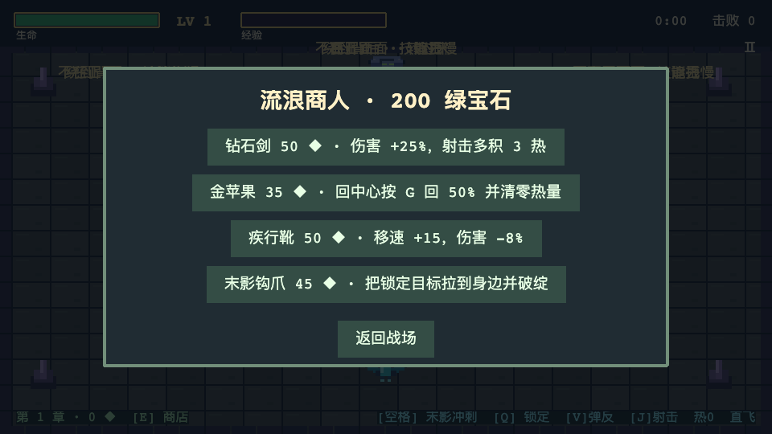

# 自动试玩报告 · 2026-09-23

本轮使用真实 Chrome、Phaser 渲染与物理碰撞，进行了失败复现、修复、场景回归、两轮持续试玩、完整回放比较和生产预览检查。

## 已复现并修复

| 问题 | 修复前证据 | 修复及验证 |
| --- | --- | --- |
| 击杀敌人时异常 | 种子 1，W+J 开局第二秒内触发 `grudging` 读取已销毁对象的 `scene.time` | 销毁前保存结算状态；击杀和后续战斗正常 |
| 拾取奖励时异常 | 修复首个崩溃后，同一开局暴露 `claimGroundLoot` 读取已销毁掉落物的 `loot.xp` | 销毁前保存掉落数据；实际拾取增加经验/金币 |
| 敌方弹丸停在原地 | 隔离生成弹丸，速度始终为 0，20 帧后位置不变 | 入物理组后再设置速度；20 帧内 Y 从 182.833 到 239.5，命中后生命从 100 到 93；掉落物采用相同顺序 |
| 原地站立自动推开弹丸 | 弹丸恢复飞行后，接近静止玩家时被转向，玩家不掉血 | 推开效果要求与弹丸同向移动；静止/迎面移动走真实命中判定 |
| 护盾正面误算侧击 | 正面弹丸也增加侧击层数，因为弹丸销毁后速度已丢失 | 销毁前计算入射方向；正面 0 层、背面 1 层 |
| 钩爪商品无法正常点击 | 商品中心被“返回战场”覆盖，点击后直接关闭商店，金币仍为 200 | 调整按钮间距；桌面和 390×844 视口都购买成功，钩爪 +1、金币变为 155 |
| 重开叠加战斗事件 | 连续三次重开后，`skill-fed` 监听器数量为 1→2→3→4 | 场景关闭时解绑本轮处理器；数量保持 1→1→1→1，并重置遗留的射击/方向状态 |

另补充缺失的 favicon，避免浏览器资源 404 混入运行错误报告。此次没有重写角色成长、章节配置或敌人技能体系。

失败证据分别保存在 [首轮复现](evidence/gameplay-checks/before-fixes-final/report.json) 和 [修复后暴露的第二轮问题](evidence/gameplay-checks/after-fixes/report.json)。首轮暂停逻辑本身通过，失败记录来自缺失 favicon 的 404，不能算作暂停功能缺陷。

## 修复后的运行结果

| 验证 | 结果 | 证据 |
| --- | --- | --- |
| 运行时回归 | 9/9 通过；包含暂停、移动、奖励、碰撞、购买、重开和方向判定 | [报告](evidence/gameplay-checks/final/report.json) |
| 种子 1 普通试玩 | 33.517 秒，14 次击杀，70 次射击，进入首个 Boss 战后死亡，无运行异常 | [最终快照](evidence/playtest/seed-1/final.json) |
| 种子 23 普通试玩 | 43.8 秒，24 次击杀，99 次射击，进入首个 Boss 战后死亡，无运行异常 | [最终快照](evidence/playtest/seed-23/final.json) |
| 完整重放种子 1 | 最终 JSON 逐字段一致，包括位置、生命、敌人、经济和界面文字 | [比较结果](evidence/playtest/replay-verification.json) |
| 实时模式 | 约 5.6 秒真实 RAF 更新，击杀 5 个敌人，无运行异常 | [实时回归快照](evidence/gameplay-checks/final/realtime-combat/final.json) |
| 交互式命令行 | 观察画面后发送移动、射击、暂停、恢复命令，状态与截图正常返回 | [操作记录](evidence/game-control/review/replay.json) |
| 生产预览 | 调试模块未打包；URL 参数不暴露调试接口；实际点击开局并进行键盘操作，无浏览器错误 | [报告](evidence/gameplay-checks/production/report.json) |
| 既有验证/构建 | `npm run verify`、`npm run build` 通过 | 构建仍有原有大包体提示 |

已查看实际截图：修复后的商店按钮不再重叠，生产画面能正常进入战斗并显示击杀结果。

## 验收边界

两轮普通试玩都使用正常伤害和生命，没有无敌、刷钱或跳关；指定问题的回归场景会显式初始化弹丸、商品资金或死亡条件，快照中的 `fixture` 字段会标记。两种证据各有用途。

本轮没有通关五章，也没有完成完整难度调平。截图仍可见战斗提示文字拥挤、边界附近画面遮挡；当前射击依赖 J，纯触屏操作的完整战斗流程尚未验收。窄屏测试验证了商店的坐标换算和点击，不能替代手机真机试玩。

后续可直接用 [调试工作流](debugging.md) 针对这些问题继续观察、记录和重放。
